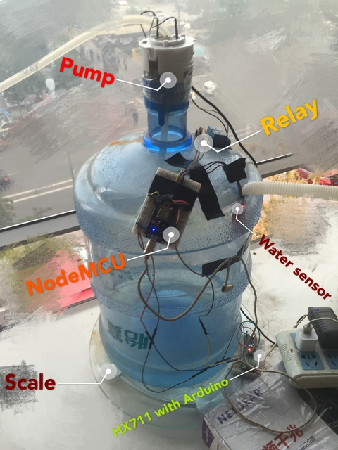

# Introduction

`nodemcu-reservoir` is a bucket with water pump that buffers water from an air-condition. The purpose is to buffer the water during daytime and pour in the midnight. But Why? Here is the scenario,

1. We have a room of servers.
1. Our office building do not provide professional air-condition device for those servers
1. Though we are allowed to install our own air-condition, we are not allowed to let the water flow out of window during the daytime.

We made this bucket (mostly for fun) to buffer the water during daytime and use a crontab to trigger a pump in the midnight to let the water go. Here are some photos of the device,

# Features

1. Trigger the pump when water is full.
2. Stop the pump when the bucket is empty
3. Remote control via telnet
